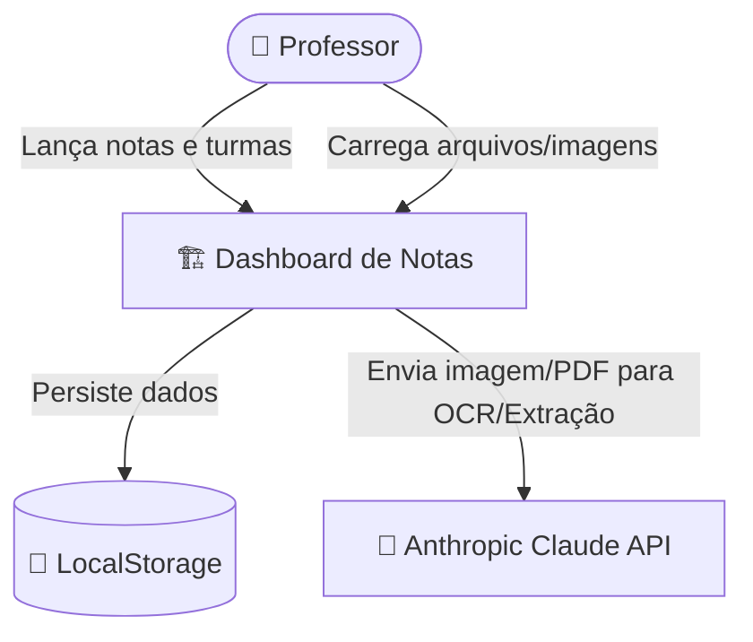
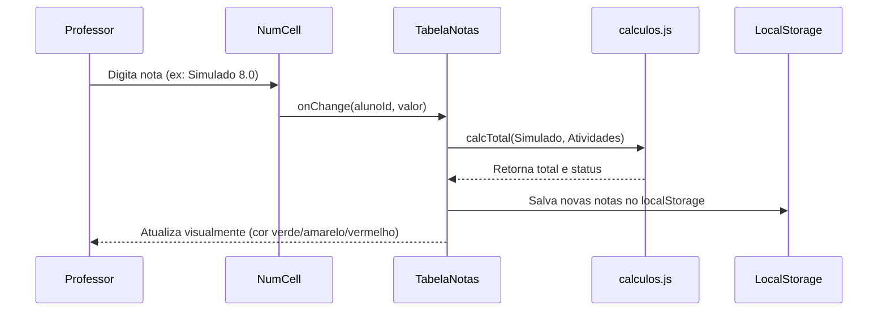

# Architecture Spec — Dashboard de Gestão de Notas

> Gerado por análise da estrutura do código e do briefing do sistema
> Data: 2026-05-26

---

## 1. Visão Geral

O Dashboard de Gestão de Notas Escolares é um aplicativo web voltado para professores do Ensino Médio. Ele simplifica o processo de cadastro de turmas, importação inteligente de listas de alunos (via tabelas Excel/CSV ou OCR/IA a partir de imagens/PDFs), e o lançamento de notas de simulados e atividades. Os dados são persistidos localmente no navegador, garantindo rapidez e privacidade.

---

## 2. Requisitos Arquiteturais

| Requisito | Tipo | Prioridade | Notas |
|-----------|------|------------|-------|
| Persistência local | Funcional | Alta | Utilização de `localStorage` para persistir turmas, alunos e notas |
| Importação XLSX/CSV | Funcional | Alta | Parseamento client-side usando `SheetJS` |
| Importação PDF/Imagem | Funcional | Média | Extração baseada em LLM via Anthropic Messages API |
| Cálculo em Tempo Real | Não-funcional | Alta | Atualização imediata de médias e status (Aprovado, Recuperação, Reprovado) |
| Responsividade e Estética | Não-funcional | Alta | Tema escuro premium (#0f0e17) com design responsivo |

---

## 3. Estilo Arquitetural Recomendado

O sistema adota uma arquitetura de **Single Page Application (SPA)** client-side estruturada em React + Vite. 

Toda a lógica de negócios, cálculo de médias e parsing de arquivos ocorre localmente no browser do usuário. A persistência é realizada diretamente no `localStorage`.

### Alternativas Descartadas

| Opção | Por que não escolhemos |
|-------|----------------------|
| Backend Tradicional (Node/Go/Python) | Overhead operacional e de infraestrutura. O armazenamento local atende à necessidade inicial do MVP. |
| Banco de dados SQL clássico | Requer infraestrutura hospedada e autenticação centralizada, aumentando a complexidade inicial. |

---

## 4. Diagrama de Contexto



---

## 5. Diagrama de Componentes

```mermaid
graph TB
    subgraph App Shell
        App[App.jsx]
    end

    subgraph State Management (Hooks)
        useTurmas[useTurmas.js]
        useNotas[useNotas.js]
    end

    subgraph Presentation Components
        Sidebar[Sidebar.jsx]
        TurmaView[TurmaView.jsx]
        TabelaNotas[TabelaNotas.jsx]
        NumCell[NumCell.jsx]
        ImportModal[ImportModal.jsx]
    end

    subgraph Utilities
        calculos[calculos.js]
        importXlsx[importXlsx.js]
        importIA[importIA.js]
    end

    App --> useTurmas
    App --> useNotas
    App --> Sidebar
    App --> TurmaView

    TurmaView --> TabelaNotas
    TurmaView --> ImportModal
    TabelaNotas --> NumCell

    TabelaNotas --> calculos
    ImportModal --> importXlsx
    ImportModal --> importIA
```

---

## 6. Decisões de Tecnologia

| Camada | Tecnologia | Motivo |
|--------|-----------|--------|
| View Engine | React 18 | Reatividade em tempo real para tabelas de notas e sincronização de estado |
| Bundler & Server | Vite | Inicialização rápida e Hot Module Replacement (HMR) eficiente |
| Estilização | Tailwind CSS v3 | Design ágil e responsivo via classes utilitárias |
| Parser de Planilhas | SheetJS (xlsx) | Excelente compatibilidade para leitura de arquivos .xlsx e .csv no client-side |
| Extração de Texto | Anthropic API | Uso da API do Claude para extração de nomes em PDF/Imagens usando visão computacional |
| Banco de Dados | LocalStorage | Persistência simples baseada no navegador, custo zero de infraestrutura |

---

## 7. Fluxos Críticos

### Fluxo de Cálculo de Nota e Status


---

## 8. Estratégia de Deploy e Infraestrutura

A aplicação é puramente estática. O build gerado pelo `vite build` consiste apenas em arquivos HTML, CSS e JavaScript estáticos.
- **Ambiente de Produção**: Pode ser hospedado gratuitamente no Vercel, Netlify ou Firebase Hosting.
- **Segurança**: A chave da API da Anthropic deve ser configurada localmente ou em variáveis de ambiente, embora no client-side puro a exposição da chave exija cuidados (idealmente, chaves restritas ou proxy em produção futura).

---

## 9. Riscos e Mitigações

| Risco | Probabilidade | Impacto | Mitigação |
|-------|--------------|---------|-----------|
| Limpeza de cache/LocalStorage | Média | Alto | Adicionar recurso de backup/exportação de dados em formato JSON para o usuário salvar seu progresso. |
| Exposição da chave Anthropic API | Alta | Médio | Em produção real, encapsular chamada à API em um Cloud Function (Serverless) simples para não expor a chave no client. |

---

## 10. Gaps de Documentação

| Elemento | Por que importa | Sugestão |
|----------|----------------|----------|
| Estrutura de configuração de atividades customizadas | Cada escola pode ter critérios diferentes de peso e notas | Salvar as configurações máximas de notas por bimestre e por turma no próprio objeto de dados. |
| Limites de armazenamento | LocalStorage possui limite aproximado de 5MB | Para listas de alunos e notas, 5MB comporta centenas de turmas. Mas é importante alertar o usuário se o limite for atingido. |
